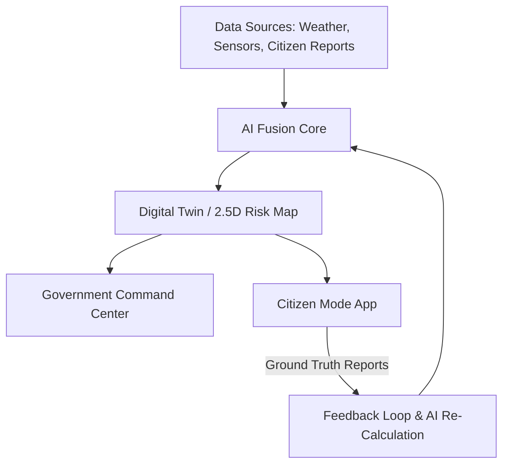

# 🌍 ClimateOS — AI-Powered Climate Disaster Intelligence & Response Platform

> **ClimateOS** is an AI-powered disaster intelligence and response platform that transforms fragmented climate data and citizen observations into verified, localized, and actionable decisions before, during, and after climate-related disasters.

---

## 🧭 Product Vision & North Star

### 🌟 North Star
> **Reducing the time between:**  
> `“Something is happening”` ➔ `“The right person is taking the right action.”`

### 🔄 Core Intelligence Loop
$$\text{Predict} \xrightarrow{\quad} \text{Sense} \xrightarrow{\quad} \text{Verify} \xrightarrow{\quad} \text{Understand} \xrightarrow{\quad} \text{Prioritize} \xrightarrow{\quad} \text{Act} \xrightarrow{\quad} \text{Learn}$$

### ⚖️ Product Principle
ClimateOS **does not replace emergency authorities**. AI acts as an intelligence and decision-support layer, while authorized humans remain responsible for final emergency decisions.

$$\text{DATA} \rightarrow \text{AI ANALYSIS} \rightarrow \text{VERIFICATION} \rightarrow \text{RISK UNDERSTANDING} \rightarrow \text{RECOMMENDATION} \rightarrow \text{HUMAN DECISION} \rightarrow \text{ACTION} \rightarrow \text{CITIZEN FEEDBACK} \rightarrow \text{AI RE-CALCULATION}$$

---

## 🎯 Problem Statement

During disasters, existing systems operate in silos. Both citizens and emergency authorities face critical information gaps:

| Target User | Core Information Needs |
| :--- | :--- |
| **Citizens** | • What is happening near me? • Am I personally at risk? • Where should I go & which route is safe? • Which shelter is available? • How can I request emergency help? |
| **Government & Responders** | • Where is the disaster actually happening? • Which citizen reports are trustworthy? • Where are vulnerable or trapped people located? • Which roads are blocked or flooded? • Where should limited rescue resources be deployed first? |

---

## 👥 Target Users

1. **Citizens**: Personal risk awareness, localized alerts, safe evacuation routing, shelter discovery, emergency reporting.
2. **Government / Disaster Authorities**: City-level situational awareness, risk prediction, AI report verification, evacuation planning, resource prioritization.
3. **Emergency Responders**: Incident priority feeds, victim locations, route safety, resource availability, and mission assignments.

---

## 🌊 Disaster Scope & MVP Focus

- **MVP Focus**: **Urban Flooding** (Deep scenario implementation).
- **Future Scope**: Extreme rainfall, heatwaves, cyclones, wildfires, drought, landslides, and air-quality emergencies.

---

## 🏛️ Core Architecture & Component Stack

| Layer | Responsibilities |
| :--- | :--- |
| **Data Sources** | Weather data, historical data, geospatial maps, citizen reports, simulated sensors |
| **AI Fusion Core** | Risk prediction, report verification, impact estimation, priority ranking, recommendations |
| **Digital Twin** | Dynamic 2D/2.5D risk map, infrastructure, hazards, incidents, safe routes |
| **Government Mode** | Situational awareness, AI recommendations, resource/rescue priorities |
| **Citizen Mode** | Personal risk alerts, safe route navigation, shelter intelligence, incident reporting |
| **Feedback Loop** | Verified citizen observations feed ground reality back into decision cycles |

---

## 🤖 Core AI Intelligence Engines

1. **Risk Prediction Engine**: Calculates geographic risk using weather, rainfall, historical data, terrain, and sensors. Outputs risk score, category, affected zone, and confidence level.
2. **AI Report Verification**: Cross-references citizen reports (photos, GPS, timestamp, nearby reports, sensor data) and assigns confidence (`High Confidence`, `Needs Review`, `Low Confidence`).
3. **Impact & Priority Engine**: Ranks incidents by urgency, severity, and human impact.
4. **Recommendation Engine**: Converts verified intelligence into human-reviewable emergency actions (evacuations, resource deployments, road closures).

---

## 📱 Citizen Ground-Truth Network & Reporting

Citizens act as a real-time sensing network. Supported report categories:
- 🌊 Flood & Water Logging
- 🔥 Fire Hazard
- 🚧 Road Blockage / Bridge Damage
- 🏢 Building & Infrastructure Damage
- ⚡ Power Failure
- 🚑 Medical Emergency
- 🆘 Trapped People
- 🚰 Water Shortage

---

## 🗺️ Key System Capabilities

- **Dynamic Risk Map & Digital Twin**: Lightweight 2D/2.5D geospatial visualization of hazard zones, roads, shelters, and incidents.
- **Personalized Risk & Action Engine**: Converts city-level risk to individual guidance (e.g., *"Inside high-risk zone. Shelter B is 800m away via Route C"*).
- **Dynamic Safe-Route Engine**: Evaluates route safety based on flood probability, road blockages, hazard severity, and emergency accessibility.
- **Shelter Intelligence**: Real-time tracking of location, capacity, current occupancy, accessibility, and status.
- **Explainable AI (XAI)**: Surfaces confidence scores and key factors (rainfall, water rise rate, low-lying terrain, verified reports) behind every recommendation.
- **Disaster Simulation Mode**: Interactive sandbox for authorities to simulate synthetic rain, rising water levels, and emergency reports to observe real-time AI recalculation.
- **Offline / Low-Connectivity**: Caches last-known risk, emergency instructions, shelters, and map data locally.

---

## 🎬 Signature Hackathon Demo Flow

1. **Predict**: Extreme rainfall increases flood risk in Zone A.
2. **Risk Rises**: Simulated water-level input pushes Zone A into high risk.
3. **Citizens Report**: Flooded road, trapped people, and blocked bridge reports arrive.
4. **Verify**: AI classifies incidents and assigns confidence scores.
5. **Update**: Digital Twin and risk map update in real-time.
6. **Recommend**: AI suggests evacuating Zone A, closing unsafe roads, opening shelters.
7. **Personalize**: Citizens receive location-specific guidance and safe routes.
8. **Ground Truth**: A citizen reports that the recommended route is now flooded.
9. **Adapt**: Route is marked unsafe and system recalculates instantly.
10. **Learn**: Ground truth feeds the next decision cycle.

---

## 📋 Functional Requirements (FR-01 to FR-14)

- **FR-01**: Calculate disaster risk for geographic zones.
- **FR-02**: Display risk levels on an interactive map.
- **FR-03**: Allow citizens to submit location-based disaster reports.
- **FR-04**: Classify reports and assign confidence scores.
- **FR-05**: Rank incidents according to severity and urgency.
- **FR-06**: Provide location-based personalized alerts.
- **FR-07**: Recommend routes based on disaster risk.
- **FR-08**: Help citizens find available shelters.
- **FR-09**: Recommend emergency resource priorities.
- **FR-10**: Provide a government command center dashboard.
- **FR-11**: Update risk and recommendations when new information arrives.
- **FR-12**: Explain major factors behind important AI outputs.
- **FR-13**: Provide a disaster simulation mode.
- **FR-14**: Feed verified citizen reports back into the intelligence loop.

---

## 🚦 Development Priorities

| Priority | Phase | Scope / Key Deliverables |
| :--- | :--- | :--- |
| **P0** | **Core Intelligence** | Risk engine, citizen reporting, AI verification, dynamic risk map, incident prioritization |
| **P1** | **Action Layer** | Personalized alerts, safe routing, shelter intelligence, resource allocation, government recommendations |
| **P2** | **Resilience & Demo** | Offline cache, explainable AI, disaster simulation mode |
| **P3** | **Future Expansion** | Live IoT integration, satellite intelligence, government integrations, multi-disaster support |

---

## 🏆 Key Differentiator & Pitch

> **One-Line Pitch:** ClimateOS is an AI disaster intelligence platform that turns climate data and citizens into a real-time sensing network, then converts that intelligence into safer decisions for both authorities and individuals.

---

## 📄 License & Document Reference

- **PRD Specification**: [`ClimateOS_PRD.pdf`](file:///Users/maithilipawar/Project/ClimateOS/ClimateOS_PRD.pdf)
- **License**: Distributed under the [GNU General Public License v3.0](LICENSE).